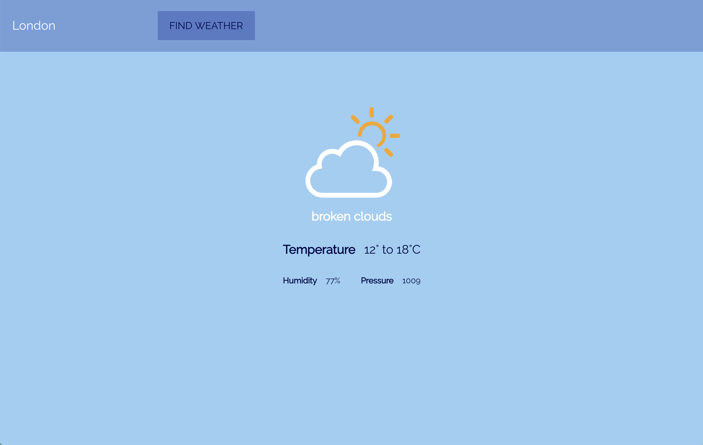

This project was bootstrapped with [Create React App](https://github.com/facebook/create-react-app).

## Set up

In the project directory, you can run:
> `npm install`
> 
> `npm start`

Runs the app in the development mode.<br>
Open [http://localhost:3000](http://localhost:3000) to view it in the browser.

The page will reload if you make edits.<br>

## Instructions

### Aim

You will be connecting to a real-time weather API to make a weather app that looks like this:



### Planning

Before you start coding, plan how you're going to structure your app. 

Look at the design:
- how could you break it up into components? 
- In which component will you fetch the weather data? 
- Which components need access to the weather data?


### Getting the weather data

We'll be using data from this API: https://openweathermap.org/current#data

The data will come in JSON format, and will look like this: https://samples.openweathermap.org/data/2.5/find?q=London&units=metric&appid=b6907d289e10d714a6e88b30761fae22

**1)** Register to get your personal API key. This is free, and will enable you to make (limited) requests to fetch the weather data you need. Follow the steps here: https://openweathermap.org/appid

**2)** Once logged in, go to the API keys tab and copy the default Key. Keep this somewhere safe as you will need it when you fetch data.


**3)** The format you'll need to follow to make API calls is:
`https://api.openweathermap.org/data/2.5/weather?q=CITY_NAME&units=metric&appid=YOUR_API_KEY`

where CITY_NAME is replaced by the city you're looking for, for example 'London', and YOUR_API_KEY is replaced with... your personal API key, of course.

example: https://api.openweathermap.org/data/2.5/weather?q=London&appid=57cf9da04987637a23fcbc26f5356e12

### Start setting up your app

- You'll need several components - you can decide how much you want to break things up into different components, but at minimum you will need a `<Search />` component, and a `<CurrentWeather />` component (you can choose the naming you like).


- The search input (e.g. 'Birmingham') will need to be inserted into the API url (see CITY_NAME above)

- The response you get from the API will need to be passed down as props to the `<CurrentWeather />` component so it knows what weather to display. 

- The response will include a `weather` array with an object inside, which looks like this:

```
"weather": [
  {
    "id": 521,
    "main": "Rain",
    "description": "shower rain",
    "icon": "09d"
  }
]
```
**This is what we'll use to display the current weather icon.**

### Matching up the weather `id` with the appropriate icon

We will **not** be using the `icon` property of the data, we will only use the `id` and match it with our own svg icons. You can find these svgs in `src/img/weather-icons`.

You will need to write some code to do the following:

| if `id` is:         | then show icon named: |
|---------------------|-----------------------|
| less than 300       | storm.svg             |
| between 300 and 499 | drizzle.svg           |
| between 500 and 599 | rain.svg              |
| between 600 and 699 | snow.svg              |
| between 700 and 799 | fog.svg               |
| equal to 800        | clear.svg             |
| equal to 801        | partlycloudy.svg      |
| between 801 and 805 | mostlycloudy.svg      |

So for example, in the above response, the `id` was 521, which is between 500 and 599, so the icon to display will be `rain.svg`

### Showing more weather information

Once you're showing the icon, you can also display information about the temperature, the humidity etc. 
Have a look at the response from the API to find this information, and try to display it as shown in the design! ;)

___________

## Stretch goals

### Display the weather forecast for the next 5 days

Add a new section to your app that will display the weather over the next 5 days in the given location.

[design in progress... ]

**Note:** You will need to make a different API call to get the 5-day forecast, as the current one only returns today's weather. The API for 5 days is here: https://openweathermap.org/forecast5

