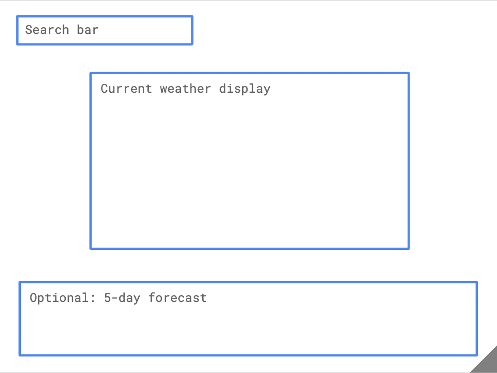

This project was bootstrapped with [Create React App](https://github.com/facebook/create-react-app).

## Set up

Please **fork** and **clone** this repository.  There are instructions for how to do that (and more), in the first half of the syllabus's ["Making a Pull Request"](https://codeyourfuture.github.io/syllabus-master/others/making-a-pull-request.html)

Then navigate to the correct directory using the command line.

Once you're in the project directory, you can run:
```bash
npm install

npm start
```

This runs the app in the development mode.

Open [http://localhost:3000](http://localhost:3000) to view it in the browser.

### Test to see if it worked
Edit `App.js` and add a tiny change, like adding your name, to see if the change appears.

Add and commit this change to git, and push it up to your remote github repo:
```git
git add App.js
git commit -m "Added my name to the app"
git push
```

Pay attention to any errors, and then check that your changes made it to github, by visiting github.com with your browser and inspecting your repo there.

All good? Then let's get coding.

## Instructions

### Aim

You will be connecting to a real-time weather API to make a weather app that looks like this:


### 1. Getting started: Static HTML and CSS

Let's start slow by creating the HTML and CSS we need to make the app look like the design: do this is `App.js` and `App.css`

Don't worry about fetching data yet, you can use **invented, "hardcoded"** values for now - just focus on getting content up on the page and imitating the design provided. However, do not leave out the values!  Put numbers in so that you can confirm how the layout will work with numbers present.  Using the numbers that occur in the screenshot is a good idea.

A few things to think of:

- The font you need is called `Raleway` and is already loaded up into the project - but remember you'll need to declare it in your CSS.
- You'll need to copy the colours, spacing, layout and size of elements in the design. This is a core skill as a front-end developer! :)
- The weather icons you need are in the `img/weather-icons` folder, but you can use a placeholder image like [this one](https://cdn2.iconfinder.com/data/icons/weather-flat-14/64/weather02-512.png) for now if that's easier. See the next section below for help with images.
- Extra points if you use media queries to make the app responsive ;)

#### A note on using images in React

There is a special way to show images from a React app created with create-react-app.  You can [read about how to add and use images in a create-react-app project in the official docs](https://facebook.github.io/create-react-app/docs/adding-images-fonts-and-files), but in short, you'll need to do these two things:

At the top of your component, import the image like this (remember to give it a name!)

```javascript
import storm from '../img/weather-icons/storm.svg';
```

Then later in your `` tag, use the imported value as the image source, like this:
```html

```

Once you're happy with the way your app looks, it's time to move on.


### 2. Break your HTML into React components

This is about cutting up your one big single block of HTML and putting sections of it in React components instead.

You'll need several components - you can decide how much you want to break things up into different components, but at minimum you will need a `<Search />` component, and a `<CurrentWeather />` component (you can choose the naming you like).



If you find yourself copy-pasting an HTML section multiple times with small changes, you've probably found a good candidate for a reusable React component.

Note that your React components at this stage should still have hardcoded numbers for temperature, etc.

### 3. Practice using props to populate your values

If you're still new to React and props you should now spend a little time practicing passing props from parent component to child component, and using those props to populate the values (such as the temperature).  

Don't invest too much time in this, however, because what we pass will change in the next step.

### 4. Let's try it with a **STATIC** JSON file

Now let's use an example **static** JSON file and use the data in that JSON object for our temperature and other values.  This means your app will read those values locally, from a static JSON file you should include in your project.

You can use this JSON file: https://samples.openweathermap.org/data/2.5/forecast?q=M%C3%BCnchen,DE&appid=b6907d289e10d714a6e88b30761fae22. 

Copy all contents into a new file and add it to your project somewhere under the `src/` directory.  Perhaps name it `FakeWeather.json` and store it in a new folder `src/data/`.

Import it into your react app with

```javascript
import FakeWeatherData from "./data/FakeWeather.json";
```

Into which react component should you load it? The highest component in the hierarchy that needs to know about the weather, or that needs to communicate it to its children.

#### About the JSON structure

Spend some time investigating the json structure and figuring out which bits you need to use.

This JSON represents weather data for **just one city**.

It includes **an array called `list` containing the weather predicitons for the next 5 days, split into 8 x 3-hour chunks** 
Each object inside `list` contains a `weather` array with an object that looks like this:

```json
"weather": [
  {
    "id": 521,
    "main": "Rain",
    "description": "shower rain",
    "icon": "09d"
  }
]
```

**Note:** the `list` data includes 36 items (to cover forecasts for 5 days). The design only requires you to use enough to cover 24 hours - so you won't need every single item in the array.

#### Extracting the values from the Fake Weather json

Now it's time to replace all of the hard-coded values in your HTML (or JSX) with values from `FakeWeather.json`.

You will probably have to pass sections of the weather object to child components, as props.

Once you've got this all working, it's time to fetch some real weather data!

### 5. Getting the LIVE weather data

We'll be using data from this API: https://openweathermap.org/forecast5 for which **you'll need an API key**:

**1)** Register to get your personal API key. This is free, and will enable you to make (limited) requests to fetch the weather data you need. Follow the steps here: https://openweathermap.org/appid

**2)** Once logged in, go to the API keys tab and copy the default Key. Keep this somewhere safe as you will need it when you fetch data.


**3)** The format you'll need to follow to make API calls is:
`http://api.openweathermap.org/data/2.5/forecast?q=${CITY_NAME}&cnt=8&units=metric&appid=${YOUR_API_KEY}`

where `CITY_NAME` is replaced by the city you're looking for, for example 'London', and `YOUR_API_KEY` is replaced with... your personal API key, of course.

example format: http://api.openweathermap.org/data/2.5/forecast?q=London&cnt=8&units=metric&appid=57cf9da04987637a23fcbc26f5356e12 (this doesn't work because it's a fake API key, but when you replace it with yours, it will ;) )

**Think about when you want to fetch your data...**

#### Thinking about data flow through your components

Look at the design:
- Which components need access to the weather data?
- The first parent of all of those is probably the one in which you would fetch the weather data.  It would then pass the details to its children via their props.

- The search input (e.g. 'Birmingham') will need to be inserted into the API url during the fetch (see CITY_NAME above)

- The response you get from the API will need to be passed down as props to the `<CurrentWeather />` component so it knows what weather to display. 

- As we've seen before, the response will include a `list` array containing the weather forecast for the next 5 days, split into chunks. **You will only need the first item in `list` to display the current weather** (you will use the rest of the items later to display *future* weather).

- Each object inside `list` contains a `weather` array with an object that looks like this:

```json
"weather": [
  {
    "id": 521,
    "main": "Rain",
    "description": "shower rain",
    "icon": "09d"
  }
]
```
**The `id` is what we'll use to display the current weather icon** (you can ignore the "icon" key in the above object).

### 6. Matching up the weather `id` with the appropriate icon

We will **not** be using the `icon` property of the data, we will only use the `id` and match it with our own SVG icons. You can find these SVGs in `src/img/weather-icons`.

You will need to write some code to do the following:

| if `id` is:         | then show icon named: |
|---------------------|-----------------------|
| less than 300       | storm.svg             |
| between 300 and 499 | drizzle.svg           |
| between 500 and 599 | rain.svg              |
| between 600 and 699 | snow.svg              |
| between 700 and 799 | fog.svg               |
| equal to 800        | clear.svg             |
| equal to 801        | partlycloudy.svg      |
| between 801 and 805 | mostlycloudy.svg      |

So for example, in the above response, the `id` was 521, which is between 500 and 599, so the icon to display will be `rain.svg`

### 7. Showing more weather information

Once you're showing the icon, you can also display information about the temperature, the humidity etc. 
Have a look at the response from the API to find this information, and try to display it as shown in the design!

### 8. Error-Handling

What should happen if the network is down, or if someone searches for a city which doesn't exist, or is misspelled?


___________

## Stretch goals

### Display the weather forecast for the next 24 hours

Add a new section to your app that will display the weather over the next 24 hours in the given location.


**Think about how you can manipulate the data to display the weather for each 3-hour chunk...**


Good luck!
